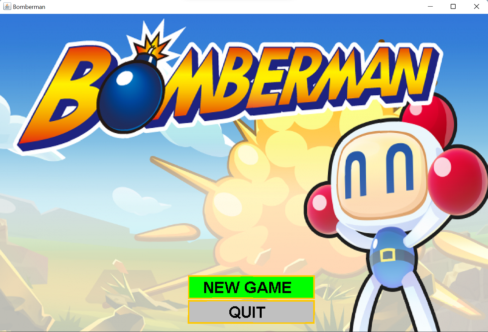
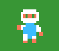
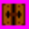
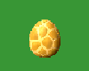
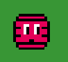
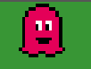

<!-- PROJECT LOGO -->
 

  <h3 align="center">BOMBERMAN GAME UET</h3>

<!-- TABLE OF CONTENTS -->
# Nội dung
1. [Giới thiệu](#Introduction)
2. [Tổng quan](#Object)
3. [Enemy](#Enemy)
4. [Item](#Item)

<!-- ABOUT THE PROJECT -->

## Giới thiệu 

Đây là dự án trò chơi của chúng tôi cho môn học Lập trình hướng đối tượng. Bomberman là một trò chơi cá nhân không yêu cầu người chơi phải có kỹ năng xuất sắc hay công nghệ tiên tiến. Đó là một trò chơi đơn giản có thể được mọi người ở mọi lứa tuổi yêu thích. Kết quả của tất cả các yếu tố này, chúng tôi đã phát triển một chương trình thân thiện với người dùng và hỗ trợ người dùng có những trải nghiệm tuyệt vời nhất có thể.

### Thành viên

| STT   |         Họ tên         
| :---: | :-------------------: | 
|   1   |     Lường Hữu Tuấn  
|   2   | Lê Song Vũ               

<!-- Game -->
 

## Đối tượng 
### Công nghệ 

- Ngôn ngữ: [JAVA](https://www.java.com/en/)
- Công cụ: [IntelliJ](https://www.jetbrains.com/idea/)
- Thuật toán: [A\* algorithms](https://www.geeksforgeeks.org/a-search-algorithm/)
- Thư viện: [JavaSwing](https://www.javatpoint.com/java-swing)

### Cách chơi 

Người chơi sẽ chỉ đạo chuyển động của nhân vật để đặt bom tiêu diệt quái vật. Sau khi người chơi tiêu diệt tất cả quái vật ở cấp độ này, một cổng sẽ mở ra cho nhân vật vào để lên cấp độ tiếp theo.

### Đối tượng trong game

- Player: Nhân vật được điều khiển bằng tổ hợp phím mũi tên mỗi lần chỉ được đặt một quả bom. Ngoài ra, nhân vật sẽ được nhận thêm những tính năng mới sau khi thu thập các item.

- Bomb: Khi bom nổ sẽ tạo ra vệt lửa, nếu nhân vật hoặc kẻ địch bắn trúng vệt lửa thì tất cả sẽ bị tiêu diệt. Độ dài của ngọn lửa sẽ tăng lên nếu nhân vật ăn được FlameItem.

- Enemy: Gồm 6 loại và được chia theo cấp độ, mỗi enemy có từng thuộc tính riêng.

 

- Item: Gồm 6 loại item để nâng cấp tính năng cho người chơi.

 

- Portal: Sau khi tiêu diệt hết quái vật, người chơi cần tìm Portal để chuyển màn chơi tiếp theo.

  

 

- Brick: Không thể đi xuyên qua, có thể phá huỷ bằng bomb và lưu trữ các item cho người chơi.

 

- Wall: Không thể đi xuyên qua và không thể bị phá huỷ.

  

 

## Enemy
<!--  -->

	<h3>1. Ballom</h3>
    

        
    

     
  
Di chuyển theo thuật toán AI_Basic:

  <ul>
    <li>Random hướng đi có thể.</li>
    <li>Sẽ random lại khi gặp vật cản hoặc hết thời gian random.</li>
  </ul>
  	
------------------------------------

     
    	<h3>2. Oneal</h3>
    

        
    

     
    
Di chuyển theo thuật toán AI_Pursue và AI_Basic:

    <ul>
      <li>Tìm toạ độ nhân vật, nếu nhìn thấy nhân vật trên một đường thẳng thì tăng tốc đuổi theo nhân vật.</li>
      <li>Khi không tìm thấy nhân vật, di chuyển theo thuật toán AI_Basic</li>
    </ul>
    	
------------------------------------

     
    	<h3>3. Kondoria</h3>
    

        
    

     
    
Di chuyển theo thuật toán AI_Pursue:

    <ul>
      <li>Tìm toạ độ nhân vật, nếu nhìn thấy nhân vật trên một đường thẳng thì tăng tốc đuổi theo nhân vật.</li>
      <li>Khi chết tạo ra đối tượng Brick cản đường nhân vật.</li>
    </ul>
    	
------------------------------------

     
    	<h3>4. Egg</h3>
    

        
    

     
    
Sau 5s sinh ra 1 đối tượng Ballom và 1 đối tượng Oneal

    	
------------------------------------

       
    	<h3>5. Mommy</h3>
    

        
    

     
    
Di chuyển theo thuật toán AI_Basic:

    <ul>
      <li>Random hướng đi có thể.</li>
      <li>Sau mỗi chu kì 10s sẽ sinh ra đối tượng Egg.</li>
    </ul>
    	
------------------------------------

     
    	<h3>6. Doll</h3>
    

        
    

     
    
Di chuyển theo thuật toán A*:

    <ul>
      <li>Đuổi theo nhân vật trong toàn map.</li>
    </ul>    
    	
------------------------------------

     

 

<!-- Items -->
## Item<a name="Item"> 

    	<h3>1. BombItem</h3>
    

        
    

     
    
Tăng số lượng bomb nhân vật được đặt.

    	
------------------------------------

 
    	<h3>2. FlameItem</h3>
    

        
    

     
    
Tăng độ dài bomb nổ.

    	
------------------------------------

 
    	<h3>3. SpeedItem</h3>
    

        
    

     
    
Tăng tốc độ di chuyển cho nhân vật.

    	
------------------------------------

 
    	<h3>4. BloodItem</h3>
    

        
    

     
    
Tăng máu cho nhât vật.

    	
------------------------------------

 
    	<h3>5. ThroughBrickItem</h3>
    

        
    

     
    
Nhân vật có thể đi xuyên qua thực thể Brick.

    	
------------------------------------

 
    	<h3>6. ImmortalItem</h3>
    

        
    

     
    
Nhân vật được bất tử trong 10s.

    	
------------------------------------

 

 
	
 END 

